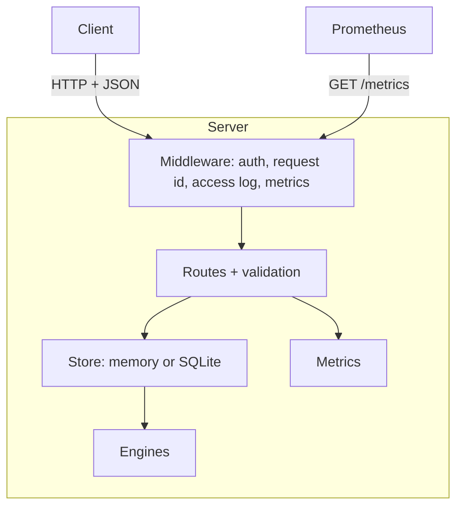
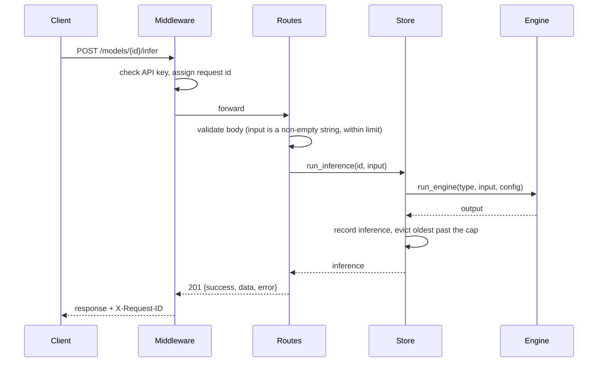

# AI Inference Server — Architecture

## Overview

A small model registry plus an inference API. Clients register named models of a given type
(`text-generation`, `text-classification`, `embedding`), run inputs against them, and read the
inference history back. The same HTTP contract is implemented four times (TypeScript, Go, Rust,
Python) so the ports can be compared and swapped behind one client.

Inference is done by deterministic in-process engines rather than real model weights. That keeps
the server dependency-free and its output reproducible, and the engine boundary is the single
place a real backend would plug in.

The Python port (`ai-inference-server-py`) is the most complete: on top of the shared contract it
adds batch inference, SSE streaming, pagination, Prometheus metrics, optional API-key auth,
configurable limits and optional SQLite persistence. See its [README](./ai-inference-server-py/README.md).

## Component Diagram

## Sequence Diagram

## Data Flow

1. A model is created with a unique (trimmed) name, a type and an optional `config`. The config is
   validated against the type before the model is stored.
2. An inference is created synchronously: the engine runs, and the result is stored with status
   `completed`, timestamps and measured `latencyMs`.
3. Each model owns a bounded, insertion-ordered history. When it exceeds
   `MAX_INFERENCES_PER_MODEL` the oldest entries are evicted.
4. Deleting a model removes its history and frees its name.
5. Batch requests are validated up front and executed under one lock, so they either run entirely
   or not at all. Streaming creates and stores the inference first, then emits its text as
   `token` events followed by a final `done` event carrying the full record.

## Wire Contract (shared by all ports)

Every response is `{"success": bool, "data": ..., "error": string | null}`.

| Route | Success | Errors |
|-------|---------|--------|
| `GET /health` | 200 | |
| `POST /models` | 201 | 400 invalid, 409 duplicate name |
| `GET /models`, `GET /models/{id}` | 200 | 404 unknown model |
| `DELETE /models/{id}` | 200 | 404 |
| `POST /models/{id}/infer` | 201 | 400 missing input, 404 |
| `GET /models/{id}/inferences[/{inferenceId}]` | 200 | 404 model or inference |

## Key Design Decisions

| Decision | Rationale |
|----------|-----------|
| Deterministic engines instead of real models | No heavy dependencies, reproducible tests, and a clear seam (`run_engine`) for a real backend |
| One response envelope everywhere, including 404/405/500 | Clients parse a single shape; no framework default error bodies leak through |
| `Store` protocol with memory and SQLite backends | The HTTP layer never knows which one it has; memory is the zero-config default, SQLite (`DATABASE_PATH`) makes data durable |
| SQLite with one shared connection behind a lock, WAL, transactional batches | Simple, safe for this workload, atomic batches, and fast reads that do not block on writers |
| Versioned schema (`user_version`); newer schemas refused | Future migrations are possible and an old server cannot corrupt a newer database |
| Bounded memory (model cap, per-model history cap) | An unauthenticated or runaway client cannot grow the process without limit |
| Python extras are additive | New fields (`latencyMs`) and endpoints do not change existing responses, so other ports stay compatible |
| Metrics label by route template, not raw path | Unknown paths collapse to `unmatched`, keeping Prometheus cardinality bounded |
| Config validated at startup | A bad `PORT` or limit fails immediately instead of at first request |
| Secrets compared in constant time | `API_KEY` checks use `hmac.compare_digest` |
| Pure-ASGI middleware, not `BaseHTTPMiddleware` | One pass handles request id, auth, rate limiting, metrics, logging and security headers without extra tasks per request; measured at about 2x the throughput of the decorator-based version |
| Body limit counts bytes as they are read | A missing or lying `Content-Length` cannot bypass `MAX_BODY_BYTES`; oversized bodies stop being read |
| Token-bucket rate limiting keyed by client, bounded table | Smooths bursts, returns accurate `Retry-After`, and the client table cannot grow without limit |
| Response schemas are pydantic models validated against real responses | The published OpenAPI document cannot drift from what the server actually returns |

## Known Limitations

- Persistence is Python-only and opt-in; the TypeScript, Go and Rust ports keep state in memory.
- Run a single worker per database file; with the in-memory store, several workers would each
  hold their own state.
- `/health` and `/metrics` count rows on every call, which is fine at the default caps.
- Auth is a single shared key, with no per-client keys. Rate limiting is per process, so with several workers each enforces its own budget.
